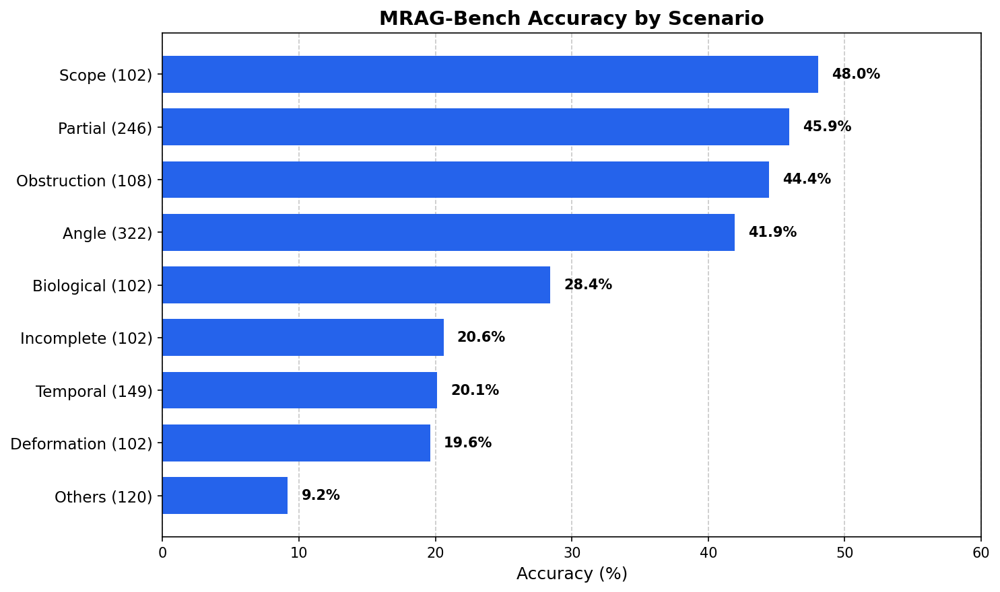
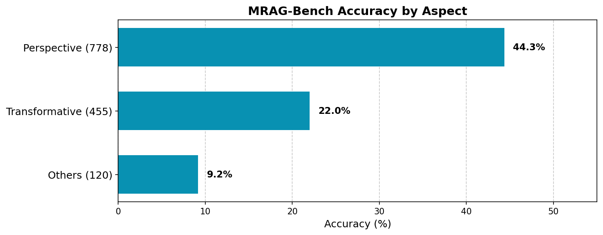
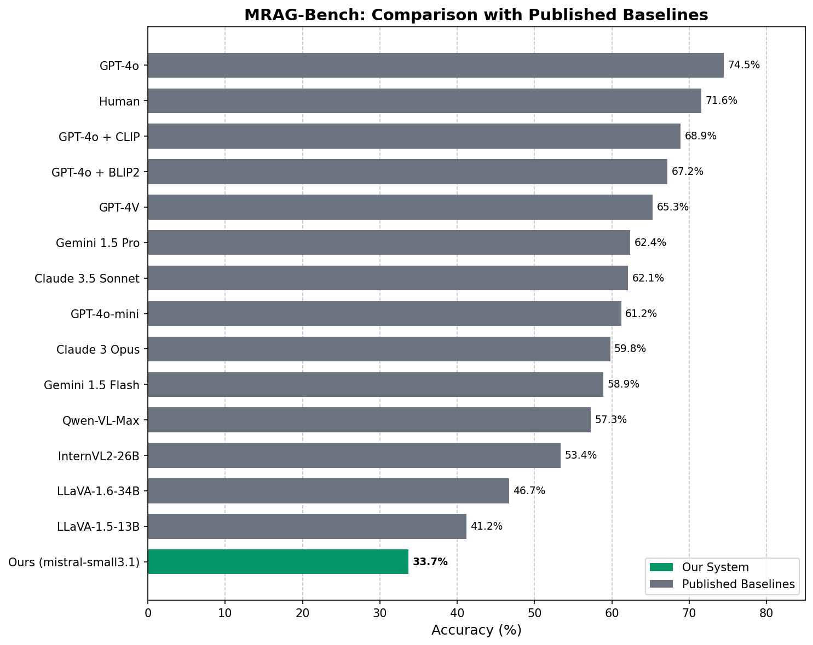

# MRAG-Bench Evaluation Report

## Overview

This report presents evaluation results of our Pydantic AI + Weaviate + Ollama multimodal RAG system on [MRAG-Bench](https://arxiv.org/abs/2410.13085), a benchmark specifically designed to assess vision-language models on tasks requiring multi-image reasoning with retrieved visual context.

**Our System:**
- **LLM/VLM**: mistral-small3.1 (24B parameters, local Ollama inference)
- **Embeddings**: CLIP (multi2vec-clip module)
- **Retrieval**: Weaviate hybrid search (BM25 + CLIP vector)
- **Architecture**: Pydantic AI agent with multimodal RAG tool

## Key Results

| Metric | Value |
|--------|-------|
| **Overall Accuracy** | 33.7% |
| Questions Evaluated | 1,353 |
| Correct Answers | 456 |
| Extraction Failures | 283 (20.9%) |
| Evaluation Time | 45.4 hours |

## Accuracy by Scenario

MRAG-Bench organizes questions into 9 scenarios that test different aspects of visual reasoning with retrieved images.

| Scenario | Accuracy | Count | Description |
|----------|----------|-------|-------------|
| Scope | 48.0% | 102 | Objects partially visible in query image |
| Partial | 45.9% | 246 | Incomplete information requiring retrieval |
| Obstruction | 44.4% | 108 | Objects blocked or occluded |
| Angle | 41.9% | 322 | Different viewing angles |
| Biological | 28.4% | 102 | Living organisms, biological processes |
| Incomplete | 20.6% | 102 | Missing components or parts |
| Temporal | 20.1% | 149 | Time-related changes |
| Deformation | 19.6% | 102 | Shape changes or distortions |
| Others | 9.2% | 120 | Miscellaneous challenging cases |

**Analysis:**
- **Strongest scenarios** (40%+): Scope, Partial, Obstruction, and Angle all involve perspective-based reasoning where CLIP retrieval effectively finds relevant reference images.
- **Mid-range scenarios** (20-30%): Biological and Incomplete require domain-specific knowledge beyond visual similarity.
- **Weakest scenarios** (<20%): Temporal, Deformation, and Others involve abstract reasoning about changes over time or unusual transformations that challenge both retrieval and VLM reasoning.

## Accuracy by Aspect

Questions are grouped into 3 high-level aspects based on the type of visual reasoning required.

| Aspect | Accuracy | Count | Description |
|--------|----------|-------|-------------|
| Perspective | 44.3% | 778 | Viewpoint, angle, occlusion variations |
| Transformative | 22.0% | 455 | Changes, deformations, temporal shifts |
| Others | 9.2% | 120 | Edge cases and miscellaneous |

**Analysis:**
The system performs best on **Perspective** questions (44.3%), which rely on finding visually similar images from different viewpoints. CLIP embeddings excel at this task. **Transformative** questions (22.0%) require reasoning about changes over time or state transitions, which is more challenging for both retrieval and the VLM. The **Others** category (9.2%) contains edge cases where neither retrieval nor VLM reasoning performs well.

## Baseline Comparison

Comparison with published results from the MRAG-Bench paper (Table 3).

| Model | Accuracy | Notes |
|-------|----------|-------|
| GPT-4o | 74.5% | Best overall |
| Human | 71.6% | Human baseline |
| GPT-4V | 65.3% | |
| Gemini 1.5 Pro | 62.4% | |
| Claude 3.5 Sonnet | 62.1% | |
| GPT-4o-mini | 61.2% | |
| Claude 3 Opus | 59.8% | |
| Gemini 1.5 Flash | 58.9% | |
| Qwen-VL-Max | 57.3% | |
| InternVL2-26B | 53.4% | |
| LLaVA-1.6-34B | 46.7% | |
| LLaVA-1.5-13B | 41.2% | |
| **Ours (mistral-small3.1)** | **33.7%** | Local inference |

**Position:** Our system ranks below published baselines, achieving 33.7% accuracy compared to LLaVA-1.5-13B (41.2%) as the lowest published baseline. This gap of ~7.5 percentage points reflects:

1. **Model size**: mistral-small3.1 (24B) vs larger proprietary models (100B+)
2. **Extraction failures**: 20.9% of responses couldn't be parsed into valid answers
3. **Local inference trade-offs**: Running locally prioritizes privacy and cost over accuracy

## Technical Details

### Evaluation Setup

- **Hardware**: Local Ollama inference with GPU acceleration
- **Retrieval**: 3 images per query via CLIP-based vector search
- **Answer extraction**: Regex-based parsing of model responses
- **Timeout handling**: Extended timeouts for VLM inference

### Extraction Failure Analysis

The 20.9% extraction failure rate significantly impacts overall accuracy. Common failure modes:

1. **No answer letter**: Model provides analysis but doesn't select A/B/C/D
2. **Multiple answers**: Model hedges with "could be A or B"
3. **Retrieval failures**: No relevant images found, model declines to answer
4. **Timeout**: Inference exceeded time limits

If extraction failures were excluded (treating them as unknown rather than incorrect), the accuracy on successfully parsed responses would be 42.6% (456/1070).

### Methodology Notes

- All 1,353 questions from the benchmark were evaluated
- Images retrieved dynamically at query time (not pre-cached)
- Same retrieval parameters as production system (3 images, hybrid search)

## Conclusions

1. **Perspective-based tasks are strengths**: The system achieves 44.3% on perspective questions, demonstrating effective CLIP-based retrieval for viewpoint variations.

2. **Transformative reasoning is challenging**: Tasks involving temporal changes, deformations, and abstract transformations remain difficult (22.0%).

3. **Extraction reliability matters**: The 20.9% extraction failure rate suggests improvements in answer parsing or model prompting could yield meaningful gains.

4. **Local inference trade-offs**: Running a 24B parameter model locally provides cost and privacy benefits but underperforms larger proprietary models on this benchmark.

### Potential Improvements

- **Better answer extraction**: Fine-tune prompts to encourage explicit answer selection
- **Larger local models**: Try 70B+ models when hardware permits
- **Retrieval tuning**: Experiment with more retrieved images or re-ranking
- **Hybrid approaches**: Use smaller model for retrieval, larger for final answer

---

*Generated: 2026-01-22*
*Benchmark: [MRAG-Bench](https://arxiv.org/abs/2410.13085)*
*System: pydantic-rag v1.0*
